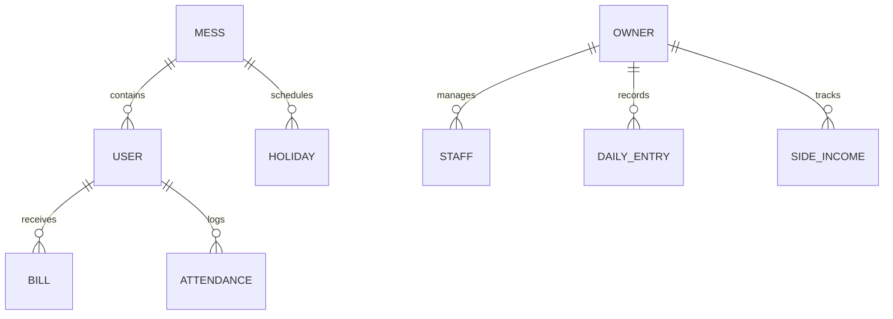

# 🏗️ Mess-Canteen-Mangement-Software - Detailed Architecture Mapping

This document provides a technical deep-dive into the interaction between the Frontend, Backend, and Database layers.

---

## 🛠️ System Overview

The project follows a **MERN-like** architecture (MongoDB, Express, React/Next, Node).

- **Frontend**: Next.js 16.1.1 (App Router) + Tailwind CSS 4.
- **Backend**: Express.js 5.2.1 + Node.js.
- **Database**: MongoDB Atlas (Cloud) + Mongoose ODM 9.0.2.
- **Communication**: RESTful API with JSON payloads & Bearer Token authentication.

---

## 🔑 1. Identity & Access Module (IAM)

### **A. Registration & User Setup**
- **Flow**: Owner is created via Super Admin or `seed.js`. Student is created via Owner.
- **Password**: Hashed using `bcryptjs` (salt rounds: 10).
- **Endpoint**: `POST /api/students` (Owner context) or `POST /api/super-admin/messes`.

### **B. Login & JWT Lifecycle**
- **Process**:
  1. Frontend (`/login`) sends credentials.
  2. Backend (`authController.js:loginUser`) verifies hashed password.
  3. Backend issues JWT (expires 30d).
  4. Frontend (`AuthContext.tsx`) stores token in `js-cookie` and User object in `localStorage`.
- **Interceptors**: `frontend/lib/api.ts` attaches `Authorization: Bearer <token>` to all outgoing requests.

### **C. Session Hydration**
- **Endpoint**: `GET /api/auth/me` (`getMe`).
- **Logic**: Backend retrieves `User`, then calls `calculations.js` to compute real-time fields for the student (Remaining Meals, Status, End Date) before returning.

---

## 🎓 2. Student Lifecycle & Dynamic Logic

### **A. The "Virtual Ledgers" Concept**
Unlike traditional systems, student state (Dues) is often tracked directly on the `User` object (`amount` and `paid` fields).
- **Pending Calculation**: `pending = User.amount - User.paid`.
- **Payment Lifecycle**: `PUT /api/bills/:id/status` simply sets `student.paid = student.amount`.

### **B. Meal Calculation Engine (`calculations.js`)**
This utility powers the entire system's dynamic data:
| Function | Description | Input |
|:---|:---|:---|
| `simulatePlan` | Core simulator for cycles. | JoinedDate + Plan + Holidays |
| `remainingMeals` | Calculates meals left in the current cycle. | PlanType + Consumption history |
| `messEndDate` | Dynamically projects the end date. | Base30Days + HolidayExtensions |
| `studentStatus` | Returns a UI object (Label/Color). | Dues + RemainingMeals + Dates |

---

## 💰 3. Billing & Financial Planning

### **A. Bill Generation Architectures**
1. **Virtual Bills** (Live): `GET /api/bills` generates on-the-fly bills by mapping active students.
2. **Historical Bills**: Managed via `Bill.create()` and `billModel.js` for monthly snapshots.

### **B. Document Processing (PDF)**
- **Feature**: `GET /api/bills/:id/pdf`.
- **Tech**: `PDFKit`.
- **Logic**: Streams a dynamic PDF with:
  - Header branding.
  - Student identity.
  - Line-item breakdown of cycle dues.
  - **Embedded UPI Link**: Constructing the `upi://pay` URI for immediate mobile app redirection.

---

## 📅 4. Attendance & Kitchen Metrics

### **A. Attendance Logic**
- **Data Source**: `GET /api/students` (includes `diet` and `studentHolidays`).
- **Data Source**: `GET /api/holidays` (Global Mess Holidays).
- **Frontend calculation (`attendance/page.tsx`)**:
  ```javascript
  const onLeave = globalHolidayToday || studentHolidayToday;
  if (!onLeave) {
    countPresent++;
    if (student.diet === 'Non Veg') nonVegCount++;
  }
  ```

---

## 🛡️ 5. Administrative Access Control

| Middleware | Role Check | Path Restriction |
|:---|:---|:---|
| `protect` | Token Validation | All private routes (`req.user` population) |
| `superAdminOnly`| `role === 'SUPER_ADMIN'`| `/api/super-admin/*` |
| `ownerOnly` | `role === 'OWNER' \|\| 'SUPER_ADMIN'` | `/api/students`, `/api/bills/generate` |
| `messStaffOnly` | `role === 'OWNER' \|\| 'MANAGER' \|\| 'SUPER_ADMIN'`| `/api/attendance`, `/api/daily-entries` |

---

## 🗃️ 6. Data Model Correlation



- **User Model**: Central identity hub (Role-based).
- **Holiday Model**: Scoped by `messId` to extend the cycles of students in that mess.
- **DailyEntry**: Scoped by date and slot (Lunch/Dinner) for canteen cash flow tracking.

---
*Last Updated: March 2026 (v1.3.1)*
